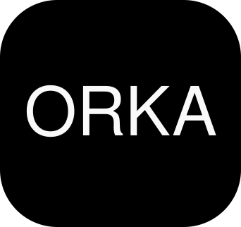

# Orka Keyboard Engine

> **Створено Perepelytsia Orka Technologies.**

## Про проект

Orka — це інтелектуальний конвертер розкладки клавіатури, що працює локально та підтримує наднизьку затримку (<100мс). Додаток збудований на C++ і забезпечує безшовну інтеграцію як на Windows (низькорівневі хуки, UI Automation), так і на Linux (X11, Wayland).

Orka підтримує мовні пари:
* **EN ↔ UK** (Англійська ↔ Українська)
* **EN ↔ KO** (Korean Dubeolsik)
* **EN ↔ HE** (Hebrew)

## Особливості
* **Кросплатформеність:** Нативна підтримка Windows (Microsoft Store MSIX) та Linux (.deb пакети).
* **Швидкість:** Конвертація відбувається локально з використанням `std::unordered_map` з доступом за O(1).
* **Безпечність для корпоративних середовищ:** Спеціальний режим Enterprise Build без встановлення глобальних хуків клавіатури/миші (EDR-compatible).

## Build & CI/CD
Проект налаштовано для автоматизованого збирання за допомогою GitHub Actions. При кожному пуші в гілку `main` автоматично генеруються інсталяційні пакети `MSIX` та `DEB`.

## Ліцензія
© 2026 Maksym Oleksandrovych Perepelytsia. All rights reserved.
